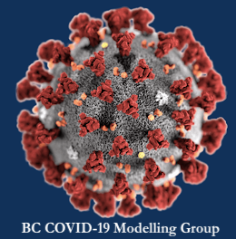

```{r setup, include=FALSE}
source("rmd_config.R")
```

## About me

.pull-left[
-   Daniel J. McDonald

-   daniel@stat.ubc.ca 

-   http://dajmcdon.github.io

-   Associate Professor, Department of Statistics 
]

.pull-right[

]


---

## Philosophy of the class

I and the TAs are here to **help you learn**. Ask questions.

We'll encourage **engagement**, **curiosity** and **generosity**
    
We favour **steady work** through the Term (vs. sleeping until finals) 

--

The  assessments attempt to reflect this ethos.

---

## More philosophy

When the term ends, I want

* You to be better at coding.
* You to have an understanding of the variety of methods available to do prediction and data analysis.
* You to articulate their strengths and weaknesses.
* You to be able to choose between different methods using __your intuition__ and __the data__.

--

I do not want

* You to be under undo stress
* You to feel the need to cheat, plagiarize, or drop the course
* You to feel treated unfairly.

--

I promise

* To grade/mark fairly. Good faith effort will be rewarded
* To be flexible. This semester is different for everyone. 
* To understand and adapt to issues.

--

I do not promise that you will all get the grade you want. 

---
class: inverse, center, middle

# COVID considerations

---

## On COVID

.pull-left[
* I watch many of Dr. Bonnie's press conferences
* I work on COVID a lot.
* Statistics is hugely important.


**Policies (TL;DR)**
* You must wear a mask (some people have exemptions)
* Do NOT come to class if you are possibly sick
* Try to avoid eating/drinking in class
* Be kind and considerate to others

[Details](https://docs.google.com/presentation/d/1VxsIiTQmXgHF7Kz13lPzD_IioKrr24os3NEBmsfSqRo/edit?usp=sharing)
]

.pull-right[
```{r, echo = FALSE}
include_graphics("gfx/delphi.jpg")

```
]

---
class: inverse, center, middle


# Course map

---

## 5 modules


.pull-left[
Baby review

1. Model accuracy and selection

2. Regularization, smoothing, trees

3. Classifiers

4. Modern techniques (classification and regression)

5. Unsupervised learning
]

.pull-right[
* Each module is approximately 2 weeks long

* Each module is based on a collection of readings and lectures

* Each module has a homework assignment

]

---

## Assessments

1. Worksheets / "Labs" 15%
1. Assignments 20%
1. Mini-quizzes 10%
1. (Group) Project 20%
1. Final Exam 35%


---

## Why this scheme?


- You stay on top of the material

- Almost entirely asychronous assessments 

- You do work outside of class

- Exam weight is diluted across the semester (no 50% final to stress over)

--

Time expectations per week:  

* Coming to class: 3 hours  
* Reading the book: 1 hour  
* Worksheets/reading checks: 1 hour
* Homework: 2 hours  
* Project: 1 hour

---

## Worksheets / Labs / Assignments / Mini-quizzes


.pull-left[
**Worksheets and labs**

Accumulate 30 points over the term.

At most 20 from each category

At most 5 per week

Submit any time you like 


* Worksheet: "complete the code" (1 point each)

* Lab: longer, some done DURING CLASS (2 points each)
]

.pull-right[
**Assignments and Mini-quizzes**

1 per module, do 4

Assignments are like long labs

Mini-quizzes are multiple choice + T/F on Canvas

Due at the same time (usually midnight on Thursday)

Done individually, but you may consult with attribution

See syllabus for admonitions about collaboration

]

---

## Textbooks

.emphasis[

*An Introduction to Statistical Learning*, James, Witten, Hastie, Tibshirani, 2013, Springer, New York. (denoted [ISLR])

Available **free** online: http://statlearning.com/

]
    
*The Elements of Statistical Learning*, Hastie, Tibshirani, Friedman, 2009, Second Edition, Springer, New York. (denoted [ESL])

Also available **free** online: https://web.stanford.edu/~hastie/ElemStatLearn/


---

## Computer

.pull-left[

]

.pull-right[
All coding in `R`

Suggest you use **RStudio** IDE

See <https://ubc-stat.github.io/stat-406/> for instructions

It tells you how to install what you will need, hopefully all at once for the whole semester.

This course is not an "intro to R/python/MongoDB/SQL" course, we will use R and we assume some background knowledge.

Links to useful supplementary resources are available on the website.
]

---

## Other resources


-   Canvas: Grades, quizzes, links to videos from class

-   Course website: All the material (slides, worksheets) https://ubc-stat.github.io/stat-406

-   Slack: Discussion board, questions.

--

-  All lectures from this year will be recorded and posted

- Most lecture videos from last year are posted

---

## Some more words

* Lectures are hard. I hope I'll get better at it.

* I hate the sound of my voice, I make small mistakes, my cat goes nuts, construction noise from across the street, etc.

* I am also nervous to be around people. If you approach me, I may back up.

* All office hours are online.

* Coding is hard. I hope you'll get better at it.

* "In-person"/ Hybrid/ Remote classes are hard. Living at home, in another country, with your siblings/kids/family is hard. 

--

There's a pandemic.

Let's be kind and understanding to each other. 

I have to give you a grade, but I want that grade to reflect your learning, not other junk.

If you need help, please ask.


---
class: middle, center

# Questions?

https://ubc-stat.github.io/stat-406/

https://learning.github.ubc.ca/STAT-406-101-2021W1


