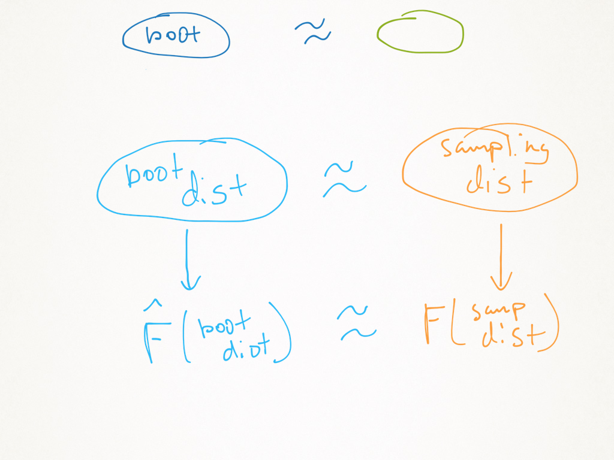

class: middle, center
background-image: url("https://i1.wp.com/bdtechtalks.com/wp-content/uploads/2018/12/artificial-intelligence-deep-learning-neural-networks-ai.jpg?w=1392&ssl=1")
background-size: cover

$$\newcommand{\Expect}[1]{E\left[ #1 \right]}
\newcommand{\Var}[1]{\mathrm{Var}\left[ #1 \right]}
\newcommand{\Cov}[2]{\mathrm{Cov}\left[#1,\ #2\right]}
\newcommand{\given}{\ \vert\ }
\newcommand{\argmin}{\arg\min}
\newcommand{\argmax}{\arg\max}
\newcommand{\R}{\mathbb{R}}
\newcommand{\P}{Pr}
\renewcommand{\hat}{\widehat}
\newcommand{\tr}[1]{\mbox{tr}(#1)}
\newcommand{\X}{\mathbf{X}}
\newcommand{\y}{\mathbf{y}}$$


```{r setup, include=FALSE, warning=FALSE, message=FALSE}
source("rmd_config.R")
```


.secondary[.larger[Module]] .huge-orange-number[4]

.secondary[.large[bagging, random forests, boosting, and neural nets]]


---

## A small detour...

.center[

]

---

.center[

]

---
layout: true

## In statistics...

The "bootstrap" works. And well.

It's good for "second-level" analysis.

* "First-level" analyses are things like $\hat\beta$, $\hat \y$, an estimator of the center (a median), etc.

* "Second-level" are things like $\Var{\hat\beta}$, a confidence interval for $\hat \y$, or a median, etc.

You usually get these "second-level" properties from "the sampling distribution of an estimator"

---

But what if you don't know the sampling distribution? Or you're skeptical of the CLT argument?

---

**Sampling distributions**

1. If $X_i$ are iid Normal $(0,\sigma^2)$, then $\Var{\overline{X}} = \sigma^2 / n$.
1. If $X_i$ are iid and $n$ is big, then $\Var{\overline{X}} \approx \Var{X_1} / n$.
1. If $X_i$ are iid Binomial $(m, p)$, then $\Var{\overline{X}} = mp(1-p) / n$


---
layout: false

## Example of unknown sampling distribution

I estimate a classification tree on some data.

I get a new $x_0$ and produce $\widehat{Pr}(y_0 =1 \given x_0)$.

Can I get a 95% confidence interval for $Pr(y_0=1 \given x_0)$?

--

**The bootstrap gives this to you.**

--

.emphasis[
__Procedure__

1. Resample your training data w/ replacement.
2. Calculate a new tree on this sample.
3. Produce a new prediction, call it $\widehat{Pr}_b(y_0 =1 \given x_0)$.
4. Repeat 1-3 $b = 1,\ldots,B$ times.
5. CI: $\left[2\widehat{Pr}(y_0 =1 \given x_0) - \widehat{F}_{boot}(1-\alpha/2),\ 2\widehat{Pr}(y_0 =1 \given x_0) - \widehat{F}_{boot}(\alpha/2)\right]$
]

--

$\hat{F}$ is the "empirical" distribution of the bootstraps. 

---

## Very basic example

* Let $X_i\sim Exponential(1/5)$. The pdf is $f(x) = \frac{1}{5}e^{-x/5}$


* I know if I estimate the mean with $\bar{X}$, then by the CLT (if $n$ is big), 

$$\frac{\sqrt{n}(\bar{X}-E[X])}{s} \approx N(0, 1).$$


* This gives me a 95% confidence interval like
$$\bar{X} \pm 2*s/\sqrt{n}$$


* But I don't want to estimate the mean, I want to estimate the median.

---

```{r, fig.align='center', fig.height=4}
ggplot(data.frame(x=c(0,12)), aes(x)) + 
  stat_function(fun=function(x) dexp(x, 1/5), color=orange) +
  geom_vline(xintercept = 5, color=blue) + # mean
  geom_vline(xintercept = qexp(.5,1/5), color=red)+ # median
  annotate("label", x = c(2.5, 5.5, 10), y = c(.15, .15, .05), 
           label = c("median","bar(x)", "pdf"), parse = TRUE,
           color = c(red, blue, orange), size = 6)
```

---

## Now what

```{r, echo=FALSE}
n = 500
```

* I give you a sample of size `r n`, you give me the sample median.

* How do you get a CI?

* You can use the bootstrap!

---

```{r, fig.align='center', fig.height=3, fig.width=8}
set.seed(2020-10-05)
x <- rexp(n, 1/5)
(med <- median(x)) # sample median
B <- 100
alpha <- 0.05
bootMed <- function() median(sample(x, replace=TRUE)) # resample, and get the median
Fhat <- replicate(B, bootMed()) # repeat B times, "empirical distribution"
CI <- 2 * med - quantile(Fhat, probs = c(1 - alpha / 2, alpha / 2))
```

```{r, echo = FALSE, fig.height=3, fig.align='center'}
ggplot(data.frame(Fhat), aes(Fhat)) + 
  geom_density(color = orange) +
  geom_vline(xintercept = CI, color=orange, linetype=2) + 
  geom_vline(xintercept = med, col=blue) + 
  geom_vline(xintercept = qexp(.5, 1/5), col=red) +
  annotate("label", x = c(3.15, 3.5, 3.75), y = c(.5, .5, 1),
           color = c(orange, red, blue),
           label = c("widehat(F)", "true~median", "widehat(median)"),
           parse = TRUE)


```


---

## How does this work?

.center[

]

---

## Approximations

.center[

]

---

## Slightly harder example

```{r, echo=FALSE}
library(MASS)
fatcats <- cats
fatcats$Hwt <- fitted(lm(Hwt~Bwt + 0, data=cats)) + rt(nrow(fatcats), 1)
fatcats <- fatcats %>% mutate(Hwt = pmin(pmax(Hwt, 3), 900*Bwt))
```

.pull-left[
```{r, fig.width=8, fig.height=6, fig.align='center'}
ggplot(fatcats, aes(Bwt, Hwt)) + 
  geom_point(color=blue) + 
  xlab("Cat body weight (Kg)") + 
  ylab("Cat heart weight (g)")
```
]

.pull-right[
```{r}
cats.lm <- lm(Hwt ~ 0 + Bwt, data = fatcats)
summary(cats.lm)
confint(cats.lm)
```
]


---

## When we fit models, we examine diagnostics


.pull-left[
```{r, fig.align='center', fig.width=7, fig.height=5}
qqnorm(residuals(cats.lm))
qqline(residuals(cats.lm))
```

**The tails are too fat. So I don't believe that CI...**
]

--

.pull-right[

**We bootstrap**

```{r}
B <- 500
bhats <- double(B)
alpha <- .05
for (b in 1:B) {
  samp <- sample(1:nrow(fatcats), replace = TRUE)
  newcats <- fatcats[samp, ] # new data
  bhats[b] <- coef(lm(Hwt ~ 0 + Bwt, data = newcats)) 
}

2 * coef(cats.lm) - # Bootstrap CI
  quantile(bhats, probs = c(1-alpha/2, alpha/2))
confint(cats.lm) # Original CI
```
]

---

## An alternative

* So far, I didn't use any information about the data-generating process. 

* We've done the "non-parametric bootstrap"

* This is easiest, and most common for the methods in this module

--

**But there's another version**

* You could try a "parametric bootstrap"

* This assumes knowledge about the DGP

---

## Same data

.pull-left[

**Non-parametric bootstrap**

Same as before

```{r}
B <- 500
bhats <- double(B)
alpha <- .05
for (b in 1:B) {
  samp <- sample(1:nrow(fatcats), replace = TRUE)
  newcats <- fatcats[samp, ] # new data
  bhats[b] <- coef(lm(Hwt ~ 0 + Bwt, data = newcats)) 
}

2 * coef(cats.lm) - # NP Bootstrap CI
  quantile(bhats, probs = c(1-alpha/2, alpha/2))
confint(cats.lm) # Original CI
```
]

.pull-right[
**Parametric bootstrap**

1. Assume that the linear model is TRUE.
2. Then, $\texttt{Hwt}_i = \beta\times \texttt{Bwt}_i + \epsilon$
3. The $\epsilon_i$ is random, just resample those.

```{r}
B <- 500
bhats <- double(B)
alpha <- .05
cats.lm <- lm(Hwt ~ 0 + Bwt, data = fatcats)
newcats <- fatcats
for (b in 1:B) {
  samp <- sample(residuals(cats.lm), replace = TRUE)
  newcats$Hwt <- predict(cats.lm) + samp # new data
  bhats[b] <- coef(lm(Hwt ~ 0 + Bwt, data = newcats)) 
}

2 * coef(cats.lm) - # Parametric Bootstrap CI
  quantile(bhats, probs = c(1-alpha/2, alpha/2))
```


]


---

## Bootstrap error sources

.center[

]


**Simulation error**:
using only $B$ samples to estimate $F$ with $\hat{F}$.

**Statistical error:** 
our data depended on a sample from the population. We don't have the whole population so we make an error by using a sample (Note: this part is what __always__ happens with data, and what the science of statistics analyzes.)

**Specification error:**
If we use the parametric bootstrap, and our model is wrong, then we are overconfident.


---
class: middle, center, inverse

# Next time...

Bootstrap for bagging and random forests