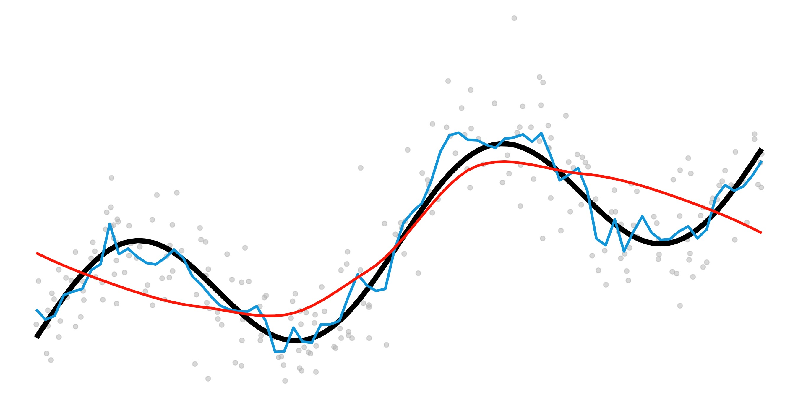

  <h1 class="display-3">STAT 406 2021W</h1>
  
Methods for Statistical Learning

  

  

  <a class="btn btn-danger btn-lg text-white" href="schedule/" role="button">Jump to Schedule.</a>
  

## Learning outcomes

At the end of the course, you will be able to: 

1. assess the prediction properties of the supervised learning methods covered in class; 
2. correctly use regularization to improve predictions from linear models, and also to identify important explanatory variables; 
3. explain the practical
difference between predictions obtained with parametric and non-parametric methods, and decide in specific applications which approach should be used; 
4. select and construct appropriate ensembles to obtain improved predictions in different contexts; 
5. select sensible clustering methods and correctly interpret their output; 
6. correctly utilize and interpret principal components and other dimension reduction techniques;
7. employ reasonable coding practices and understand basic R syntax and function.

{: class="center-img"}

## Short list of covered topics

Flexible, data-adaptive methods for regression and classification models; regression smoothers;
penalty methods; assessing accuracy of prediction; model selection; robustness; classification and
regression trees; nearest-neighbour methods; ensembles; unsupervised learning.

