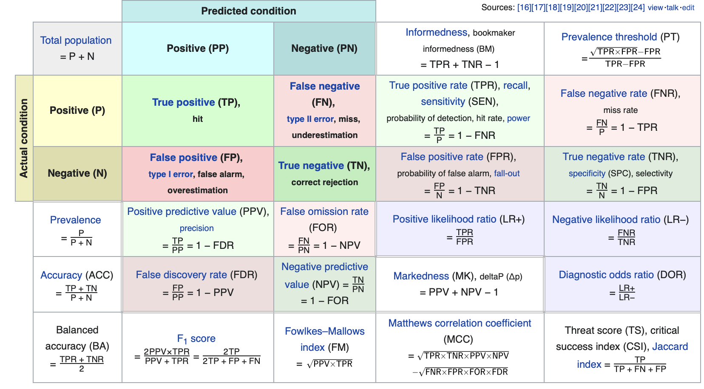

```{r setup, include=FALSE, warning=FALSE, message=FALSE}
source("rmd_config.R")
```

```{r css-extras, file="css-extras.R", echo=FALSE}
```


## How do we measure accuracy?

**So far** --- 0-1 loss. If correct class, lose 0 else lose 1.

**Asymmetric classification loss** --- If correct class, lose 0 else lose something.

For example, consider facial recognition. Goal is "person ok", "person has expired passport", "person is a known terrorist"

1. If classify ok, but was terrorist, lose 1000000
1. If classify ok, but expired passport, lose 2
1. If classify terrorist, but was ok, lose 100
1. If classify terrorist, but was expired passport, lose 10
1. etc.

Results in a 3x3 matrix of losses with 0 on the diagonal.

```{r echo=FALSE, R.options=list(scipen=8)}
matrix(c(0,10,1000000, 2, 0, 50000, 30, 100, 0), nrow = 3)
```

---

## Deviance loss

Sometimes we output **probabilities** as well as class labels.

For example, logistic regression returns the probability that an observation is in class 1. $P(Y_i = 1) = 1 / (1 + \exp\{-x'_i \hat\beta\})$

LDA and QDA produce probabilities as well. So do Neural Networks (typically)

(Trees "don't", neither does KNN, though you could fake it)

--

 ---

* Deviance loss for 2-class classification is $\sum_{i=1}^n -2\textrm{log-likelihood}(y, \hat{p}) = \sum_{i=1}^n -2 (y_i x'_i\hat{\beta} - \log (1-\hat{p}))$

(Technically, it's the difference between this and the loss of the null model, but people play fast and loose)

* Could also use cross entropy or Gini index.

---

## Calibration

Suppose we predict some probabilities for our data, how often do those events happen?

In principle, if we predict $\hat{p}(x_i)=0.2$ for a bunch of events observations $i$, we'd like to see about 20% 1 and 80% 0.

The same goes for the other probabilities. If we say "20% chance of rain" it should rain 20% of such days.


Of course, we didn't predict **exactly** $\hat{p}(x_i)=0.2$ ever, so lets look at $[.15, .25]$.

```{r}
x <- seq(-5, 5, length.out = 1000)
p <- 1 / (1 + exp(-x))
y <- rbinom(1000, 1, p)
dat <- data.frame(y = y, x = x)
fit <- glm(y ~ x, family = binomial, data = dat)
dat$phat <- predict(fit, type = "response") # predicted probabilities
mean(dat$y[dat$phat > 0.15 & dat$phat < 0.25])
```

---

## Calibration plot

```{r}
binary_calibration_plot <- function(y, phat, nbreaks = 10) {
  dat <- data.frame(y = y, phat = phat) %>%
    mutate(bins = cut_number(phat, n = nbreaks))
  midpts <- quantile(dat$phat, seq(0, 1, length.out = nbreaks + 1), na.rm = TRUE)
  midpts <- midpts[-length(midpts)] + diff(midpts) / 2
  sum_dat <- dat %>% 
    group_by(bins) %>%
    summarise(p = mean(y, na.rm = TRUE), 
              se = sqrt(p * (1 - p) / n())) %>%
    arrange(p)
  sum_dat$x <- midpts
  
  ggplot(sum_dat, aes(x = x)) + 
    geom_errorbar(aes(ymin = pmax(p - 1.96*se, 0), ymax = pmin(p + 1.96*se, 1))) +
    geom_point(aes(y = p), color = blue) + 
    geom_abline(slope = 1, intercept = 0, color = orange) +
    ylab("observed frequency") + xlab("average predicted probability") +
    coord_cartesian(xlim = c(0, 1), ylim = c(0, 1)) +
    geom_rug(data = dat, aes(x = phat), sides = 'b')
}
```

---

## Amazingly well-calibrated

```{r, fig.width=8, fig.height=5, fig.align="center"}
binary_calibration_plot(y, dat$phat, 20L)
```

---

## Less well-calibrated

```{r, echo=FALSE, fig.width=8, fig.height=6, fig.align="center"}
data("bakeoff_train", package = "Stat406")
baked <- bakeoff_train %>% dplyr::select(winners, percent_star:technical_median)
baked <- baked[complete.cases(baked),]
phat <- predict(glm(winners ~ ., family = binomial, data = baked), type = "response")
binary_calibration_plot(baked$winners, phat, 10L)
```


---

## True positive, false negative, sensitivity, specificity

**True positive rate** - # correct predict positive  / # actual positive (1 - FNR)

**False negative rate** - # incorrect predict negative  / # actual positive (1 - TPR), Type II Error

**True negative rate** - # correct predict negative  / # actual negative

**False positive rate** - # incorrect predict positive  / # actual negative (1 - TNR), Type I Error


**Sensitivity** - TPR, 1 - Type II error

**Specificity** - TNR, 1 - Type I error

--

 ---
 
**ROC (Receiver Operating Characteristic) Curve** - TPR (sensitivity) vs. FPR (1 - specificity)
 
**AUC (Area under the curve)** - Integral of ROC. Closer to 1 is better.
 
So far, we've been thresholding at 0.5, though you shouldn't always do that. 
 
With unbalanced data (say 10% 0 and 90% 1), if you care equally about predicting both classes, you might want to choose a different cutoff (like in LDA).
 
To make the **ROC** we look at our errors **as we vary the cutoff**
 
---

## ROC curve


.pull-left[

```{r}
roc <- function(prediction, y) {
  op <- order(prediction, decreasing = TRUE)
  preds <- prediction[op]
  y <- y[op]
  noty <- 1 - y
  if (any(duplicated(preds))) {
    y <- rev(tapply(y, preds, sum))
    noty <- rev(tapply(noty, preds, sum))
  }
  data.frame(
    FPR = cumsum(noty) / sum(noty), 
    TPR = cumsum(y) / sum(y))
}

roc_plt <- ggplot(roc(dat$phat, dat$y), 
                  aes(FPR, TPR)) +
  geom_step(color = blue, size = 2) +
  geom_abline(slope = 1, intercept = 0)
```

]

.pull-right[

```{r, echo=FALSE}
roc_plt
```

]

---

## Other stuff



* Source: worth exploring [Wikipedia](https://en.wikipedia.org/wiki/Receiver_operating_characteristic)
