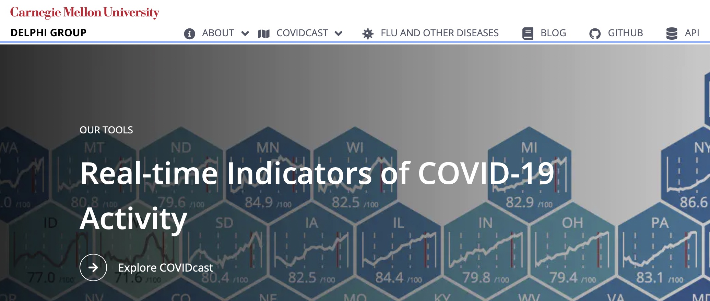
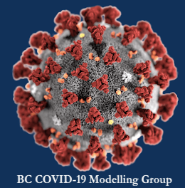
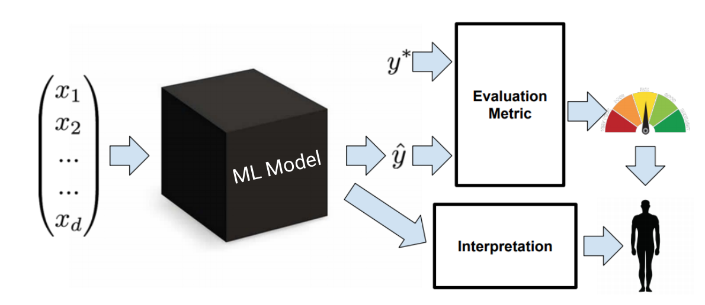

```{r setup, include=FALSE}
source("rmd_config.R")
```

```{r css-extras, file="css-extras.R", echo=FALSE}
```


## About me

.pull-left[
-   Daniel J. McDonald

-   daniel@stat.ubc.ca 

-   http://dajmcdon.github.io

-   Associate Professor, Department of Statistics 
]

.pull-right[

]


---

## Philosophy of the class

I and the TAs are here to **help you learn**. Ask questions.

We'll encourage **engagement**, **curiosity** and **generosity**
    
We favour **steady work** through the Term (vs. sleeping until finals) 

--

The  assessments attempt to reflect this ethos.

---

## More philosophy

When the term ends, I want

* You to be better at coding.
* You to have an understanding of the variety of methods available to do prediction and data analysis.
* You to articulate their strengths and weaknesses.
* You to be able to choose between different methods using __your intuition__ and __the data__.

--

I do not want

* You to be under undo stress
* You to feel the need to cheat, plagiarize, or drop the course
* You to feel treated unfairly.

--

I promise

* To grade/mark fairly. Good faith effort will be rewarded
* To be flexible. This semester (like the last 4) is different for everyone. 
* To understand and adapt to issues.

--

I do not promise that you will all get the grade you want. 

---
class: inverse, center, middle

# COVID considerations

---

## On COVID

.pull-left[
* I work on COVID a lot.

* Statistics is hugely important.


### Policies (TL; DR)

* I strongly encourage you to wear a mask

* Do .secondary[NOT] come to class if you are possibly sick

* Be kind and considerate to others

* The Marking scheme is flexible enough to allow some missed classes
]


.pull-right[
```{r, echo = FALSE}


```
]

---
class: inverse, center, middle


# Course map

---

## What is this course about?



???

- We'll talk about lots of ML models
- But our focus is on how to "understand" everything in this diagram.
- How do we interpret? Evaluate? Choose a model? 
- What are the implications / assumptions implied by our choices?
- Deep understanding of statistics helps with intuition.

---
class: middle, center


---
class: middle, center


---
class: middle, center


---

## Predictive models

<br><br>

### 1. Preprocessing 

centering / scaling / factors-to-dummies / basis expansion / missing values / dimension reduction / discretization / transformations

### 2. Model fitting

Which box do you use?

### 3. Prediction

Repeat all the preprocessing on new data. But be careful.

### 4. Postprocessing, interpretation, and evaluation

---

## 6 modules


.pull-left[
1. Review (today and next week)

2. Model accuracy and selection

3. Regularization, smoothing, trees

4. Classifiers

5. Modern techniques (classification and regression)

6. Unsupervised learning
]

.pull-right[
* Each module is approximately 2 weeks long

* Each module is based on a collection of readings and lectures

* Each module (except the review) has a homework assignment 

]

---

## Assessments


### Effort-based

Total across three components: 70 points, any way you want

1. .secondary[Labs], up to 20 points (2 each)

1. .secondary[Assignments], up to 60 points (15 each)

1. .secondary[Clickers], up to 10 points


### Knowledge-based

Final Exam, 30 points


---

## Why this scheme?

- You stay on top of the material

- You come to class and participate

- You gain coding practice in the labs

- You work hard on the assignments

- Most of this is "Effort based": work hard, guarantee yourself 70%

--

Time expectations per week:  

* Coming to class: 3 hours  
* Reading the book: 1 hour  
* Labs: 1 hour  
* Homework: 4 hours  

???

Show the course website https://ubc-stat.github.io/stat-406/

---

## Labs / Assignments / Clickers

### The goal is to "Do the work"

.pull-left[


.secondary[Assignments]

* Not easy, especially the first 2, especially if you are unfamiliar with R / Rmarkdown / ggplot

* You may revise for 50% of missed points, see [Syllabus](https://ubc-stat.github.io/stat-406/syllabus/). Only if you get 10 or lower. Penalties can't be redeemed.

* Don't leave these for the last minute

.secondary[Labs]

* Labs should give you practice, allow for questions with the TAs.

* They are due at 2300 on the day of your lab, lightly graded.

* You may do them at home, but you must submit individually (in lab, you may share submission)


* Labs are lightly graded

]

.pull-right[

.secondary[Clickers]

* Questions are similar to the Final

* 0 points for skipping, 2 points for trying, 4 points for correct
    * Average of 3 = 10 points (the max)
    * Average of 2 = 5 points
    * Average of 1 = 0 points

* Be sure to sync your device in Canvas.

.secondary[Average < 1 drops your Final Mark 1 letter grade]


]


---

.pull-left[
### Final Exam

* Scheduled by the university.

* It is hard

* The median last year was 50%.

.secondary[Philosophy:]
> If you put in the effort, you're guaranteed a B-, but to get an A+, you should really deeply understand the material.

No penalty for skipping the final. 

If you're cool with B- and hate tests, then that's fine.

]

--

.pull-right[
### Advice

* Skipping HW makes it hard to get to 70.

* Come to class!

* Yes it's at 8am. I hate it too.

* To compensate, I will record the class and post to Canvas.

* In terms of last year's class, attendence in lecture and active engagement (asking questions, coming to office hours, etc.) is the best predictor of success. 

]

--

* Last year, I received 20+ requests for Letters of Recommendation. This year, if you don't make a habit of participation, I won't write a letter.

--

.secondary[.center[.larger[Questions?]]]

---

## Textbooks

.emphasis[

*An Introduction to Statistical Learning*, James, Witten, Hastie, Tibshirani, 2013, Springer, New York. (denoted [ISLR])

Available **free** online: http://statlearning.com/

]

<hr>
    
*The Elements of Statistical Learning*, Hastie, Tibshirani, Friedman, 2009, Second Edition, Springer, New York. (denoted [ESL])

Also available **free** online: https://web.stanford.edu/~hastie/ElemStatLearn/

--

 ---

It's worth your time to read.

If you need more practice, read the Worksheets.


---

## Computer

.pull-left[

]

.pull-right[
All coding in `R`

Suggest you use **RStudio** IDE

See <https://ubc-stat.github.io/stat-406/> for instructions

It tells you how to install what you will need, hopefully all at once for the whole semester.

.emphasis[This course is not an 
intro to R / python / MongoDB / SQL.]

We will use R and we assume some background knowledge.

Links to useful supplementary resources are available on the website.
]

---

## Other resources


-   Canvas: Grades, links to videos from class

-   Course website: All the material (slides, extra worksheets) https://ubc-stat.github.io/stat-406

-   Slack: Discussion board, questions.

- Github: Homework / Lab submission

--

<hr>

-  All lectures will be recorded and posted

- I cannot guarantee that they will all work properly (sometimes I mess it up)

---

## Some more words

* Lectures are hard. It's 8am, everyone's tired.

* I am also nervous to be around people. If you approach me, I may back up.

* Coding is hard. I hope you'll get better at it.

* "In-person" / Hybrid / Remote classes are hard. Living at home, in another country, with your siblings/kids/family is hard. 

* I strongly urge you to get up at the same time everyday. My plan is to go to the gym on MWF. It's really hard to sleep in until 10 on MWF and make class at 8 on T/Th.

--

<hr>

There's (still) a pandemic.

Let's be kind and understanding to each other. 

I have to give you a grade, but I want that grade to reflect your learning and effort, not other junk.

If you need help, please ask.


---
class: middle, center

.secondary[.larger[Questions?]]

https://ubc-stat.github.io/stat-406/

https://github.com/stat-406-2022w/


