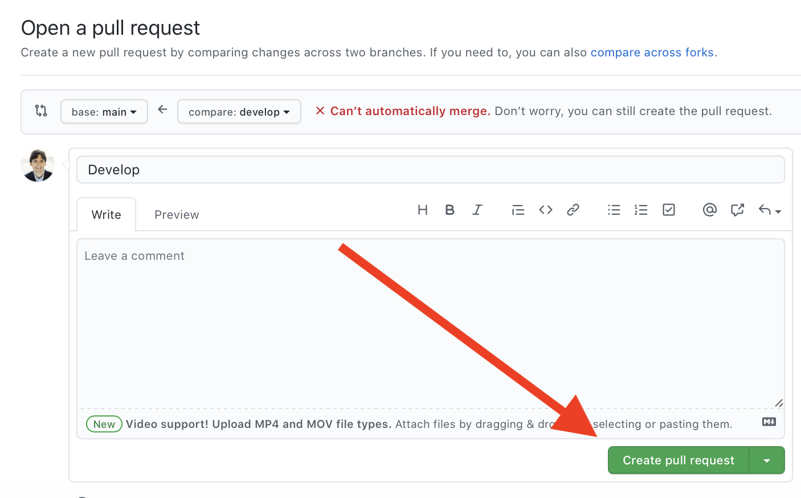

```{r setup, include=FALSE}
source("rmd_config.R")
```


## Course communication

**Website:**

<https://ubc-stat.github.io/stat-406/>

* Hosted on Github.

* Links to slides and all materials

* Syllabus is there. Be sure to read it.


**Slack:**

* Link to join on Canvas. This is our discussion board.

* Note that this data is hosted on servers outside of Canada. You may wish to use a pseudonym to protect your privacy.

* Anything super important will be posted to Slack and Canvas. 

* Be sure you get Canvas email.

* If I am sick, I will cancel class or arrange a substitute.

---

**Github organization**

* Linked from the website.

* This is where you complete/submit assignments/projects/in-class-work

* This is also hosted on Servers outside Canada <https://github.com/stat-406-2022w/>

---

## Why these?

* Yes, some data is hosted on servers in the US.

* But in the real world, no one uses Canvas / Piazza, so why not learn things they do use?

* Much easier to communicate, "mark" or comment on your work

* Much more DS friendly

* Note that MDS uses both of these, the Stat and CS departments use both, many faculty use them, Google / Amazon / Facebook use things like these, etc.

--

Slack help from MDS [features](https://ubc-mds.github.io/resources_pages/slack/) and [rules](https://ubc-mds.github.io/resources_pages/slack_asking_for_help/)

---
class: middle, center, inverse

# Git and Github

---


## Why version control?

.center[


]

* Much of this lecture is borrowed/stolen from Colin Rundel and Karl Broman

---

## Why version control?

* Simple formal system for tracking all changes to a project

* Time machine for your projects
    + Track blame and/or praise
    + Remove the fear of breaking things

* Learning curve is steep, but when you need it you REALLY need it

> Your closest collaborator is you six months ago, but you don’t reply to emails.
> -- _Paul Wilson_

---

## Why Git?

.pull-left[
* You could use something like Box or Dropbox

* These are poor-man's version control

* Git is much more appropriate

* It works with large groups

* It's very fast

* It's much better at fixing mistakes

* Tech companies use it (so it's in your interest to have some experience)

.emphasis[

This will hurt, but what doesn't kill you, 

makes you stronger.
]
]

.pull-right[


]


---

## Overview


* `git` is a command line program that lives on your machine

* If you want to track changes in a directory, you type `git init`

* This creates a (hidden) directory called `.git`

* The `.git` directory contains a history of all changes made to "versioned" files

* This top directory is referred to as a "repository" or "repo"

* `github.com` is a service that hosts a repo  remotely and has other features: issues, project boards, pull requests, renders `.ipynb` & `.md`

* Some IDEs (pycharm, RStudio, VScode) have built in `git` 

* `git`/`github.com` is broad and complicated. Here, just what you **need**

---

## Aside on built-in / command line

.emphasis[
First things first, RStudio and the Terminal
]


* Command line is the "old" type of computing. You type commands at a prompt and the computer "does stuff". 

* You may not have seen where this is. RStudio has one built in called "Terminal"

* The Mac System version is also called "Terminal". If you have a Linux machine, this should all be familiar.

* Windows is not great at this.

* To get the most out of Git, you have to use the command line.

* We'll practice this in the Lab next week.

* But, if everything goes right, you can do everything you need directly from RStudio point + click.

---

## Typical workflow for doing stuff (command line)


.pull-left[
1. Download a repo from Github
```bash
git clone https://github.com/stat-406-2022W/labs-dajmcdon.git
```
2. Create a **branch**
```bash
git branch <branchname>
```
3. Make changes to your files.
4. Add your changes to be tracked ("stage" them)
```bash
git add <name/of/tracked/file>
```
5. Commit your changes
```bash
git commit -m "Some explanatory message"
```


**Repeat 3--5 as needed. Once you're satisfied**

* Push to Github
```bash
git push
git push -u origin <branchname>
```
]

.pull-right[.center[
<br/><br/><br/>


]]


---
## What should be tracked?

**Definitely** code, markdown documentation, tex files, bash scripts/makefiles, ...

**Possibly** logs, jupyter notebooks, images (that won’t change), ...

**Questionable** processed data, static pdfs, ...

**Definitely not** full data, continually updated pdfs (other things compiled from source code), ...

---

## What things to track


* You decide what is "versioned". 

* A file called `.gitignore` tells `git` files or types to never track

```bash
# History files
.Rhistory
.Rapp.history

# Session Data files
.RData

# User-specific files
.Ruserdata
```

* Shortcut to track everything (use carefully):

```bash
git add .
```


---

## Rules


### Homework and Labs

* You each have your own repo

* You make a branch

* .secondary.hand[DO NOT] rename files

* Make enough commits (3 for labs, 5 for HW).

* Push your changes (at anytime) and make a PR against `main` when done.

* TAs review your work.

* On HW, if you want to revise, make changes in response to feedback and push to the same branch.


---

## What's a PR?

* This exists on Github (not git)

* Demonstration

--

.pull-left[.center[

]]

.pull-right[.center[

]]

---

## Some things to be aware of

* `master` vs `main`

* If you think you did something wrong, stop and ask for help

* There are guardrails in place. But those won't stop a bulldozer.

* The hardest part is the initial setup. Then, this should all be rinse and repeat.

* This book is great: [Happy Git with R](https://happygitwithr.com)
    1. See Chapter 6 if you have install problems.
    1. See Chapter 10 for credential caching (avoid typing a password all the time)
    1. See Chapter 13 if RStudio can't find `git`
    

---

## The `main/develop/branch` workflow

* When working on your own
    1. Don't NEED branches.
    1. I often make a branch if I want to try a modification without breaking what I have.
    1. Otherwise, can "pretend `git` is Dropbox": work on `main`, make changes and commits, sync to remote for backup purposes.
    
--
    
* When working on a large team with production grade software
    1. `main` is protected, released version of software (maybe renamed to `release`)
    1. `develop` contains things not yet on `main`, but thoroughly tested
    1. On a schedule (once a week, once a month) `develop` gets merged to `main`
    1. You work on a `feature` branch off `develop` to build your new feature
    1. You do a PR against `develop`. Supervisors review your contributions
    
--

I and many DS/CS/Stat faculty use this workflow with my lab.
    
--

### Protection

* Typical for your PR to trigger tests to make sure you don't break things
* Typical for team members or supervisors to review your PR for compliance


---

## Guardrails

* The `.github` directory contains interactions with Github

    1. Actions: On push / PR / other Github does something on their server (builds a website, runs tests on code)
    1. PR templates: Little admonitions when you open a PR
    1. Branch protection: prevent you from doing stuff
    
* In this course, I protect `main` so that you can't push there

.emphasis[
If you try to push to `main`, it will give an error like
```bash
remote: error: GH006: Protected branch update failed for refs/heads/main.
```
]

* I also use a PR template. It gives you some instructions that you should follow

--

.alert[
Read the PR template!!
]


---

## Operations in Rstudio 

1. Stage
1. Commit
1. Push
1. Pull
1. Create a branch

--

.emphasis[
Covers:
* Everything to do your HW / Labs if you're careful
* Plus most other things you "want to do"
]

--

#### Command line versions (of the same)

```bash
git add <name/of/file>
git commit -m "some useful message"
git push
git pull
git checkout -b <name/of/branch>

```

---

## Other useful stuff (but command line only)

.pull-left[
.primary[Initializing]
```bash
git config user.name --global "Daniel J. McDonald"
git config user.email --global "daniel@stat.ubc.ca"
git config core.editor --global nano 
# or emacs or ... (default is vim)
```


.primary[Staging]
```bash
git add name/of/file # stage 1 file
git add . # stage all
```

.primary[Committing]
```bash
# stage/commit simultaneously
git commit -am "message" 

# open editor to write long commit message
git commit 
```

.primary[Pushing]
```bash
# If branchname doesn't exist
# on remote, create it and push
git push -u origin branchname
```
]

.pull-right[
.primary[Branching]
```bash
# switch to branchname, error if uncommitted changes
git checkout branchname 
# switch to a previous commit
git checkout aec356

# create a new branch
git branch newbranchname

# create a new branch and check it out
git checkout -b newbranchname

# merge changes in branch2 onto branch1
git checkout branch1
git merge branch2

# grab a file from branch2 and put it on current
git checkout branch2 -- name/of/file

git branch -v # list all branches
```

.primary[Check the status]
```bash
git status
git remote -v # list remotes
git log # show recent commits, msgs
```


]

---

## Conflicts

Sometimes you merge things and "conflicts" happen.

Meaning that changes on one branch would overwrite changes on a different branch.

They look like this.

```bash
Here are lines that are either unchanged from the common
ancestor, or cleanly resolved because only one side changed.

But below we have some troubles
<<<<<<< yours:sample.txt
Conflict resolution is hard;
let's go shopping.
=======
Git makes conflict resolution easy.
>>>>>>> theirs:sample.txt

And here is another line that is cleanly resolved or unmodified.
```

You get to decide, do you want to keep

1. Your changes (above `======`)
2. Their changes (below `======`)
3. Both.
4. Neither.

But always delete the `<<<<<`, `======`, and `>>>>>` lines.

---

## Some other pointers

* Commits have long names: `32b252c854c45d2f8dfda1076078eae8d5d7c81f`

* If you want to use it, you need "enough to be unique": `32b25`

* Online help uses directed graphs in ways different from statistics:
    * In stats, arrows point from cause to effect, forward in time
    * In git docs, it's reversed, they point to the thing on which they depend
    
    
### Cheat sheet

<https://training.github.com/downloads/github-git-cheat-sheet.pdf>


---

## How to undo in 3 scenarios

* Suppose we're concerned about a file named `README.md`
* Often, `git status` will give some of these as suggestions

.pull-left[
**1.** Saved but not staged
* In RStudio, select the file and click `r fa("gear", fill="blue")` `r fa("caret-down")` then select `r fa("arrow-rotate-left", fill="red")` Revert...
```bash
# grab the previously committed version
git checkout -- README.md 
```

**2.** Staged but not committed
* In RStudio, uncheck the box by the file, then use the method above.
```bash
# unstage
git reset HEAD README.md
git checkout -- README.md
```
]

.pull-right[

**3.** Committed
* Not easy to do in RStudio...
```bash
# check the log to see where you made the chg, 
git log
# go one step before that (eg to 32b252)
# and grab that earlier version
git checkout 32b252 -- README.md
```
```bash
# alternatively
# if it happens to also be on another branch
git checkout otherbranch -- README.md
```
]

---

## Recovering from things

1. Accidentally did work on main, Tried to Push but got refused
```bash
# make a new branch with everything, but stay on main
git branch newbranch
# find out where to go to
git log
# undo everything after ace2193
git reset --hard ace2193
git checkout newbranch
```

2. Made a branch, did lots of work, realized it all s**ks
```bash
git checkout main
git branch -d badbranch
```

3. Anything more complicated, either post to Slack or LMGTFY

4. In the Lab next week, you'll practice 
    * Doing it right.
    * Recovering from some mistakes.
    
---

# Example of setting up labs

* Cloning your repo.

* Creating a branch.

* Knitting the Rmd.

* Where to put answers.