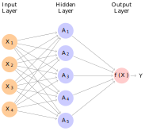
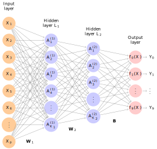

```{r setup, include=FALSE, warning=FALSE, message=FALSE}
source("rmd_config.R")
```

```{r css-extras, file="css-extras.R", echo=FALSE}
```


## Overview

Neural networks are models for supervised
learning

 
Linear combinations of features  are passed
through a non-linear transformation in successive layers

 
At the top layer, the resulting latent
factors are fed into an algorithm for
predictions

(Most commonly via least squares or logistic loss)

 

---

## Background

.pull-left[
Neural networks have come about in 3 "waves" 

The first was an attempt in the 1950s to model the mechanics of the human brain

Through psychological and anatomical experimentation, it appeared the
brain worked by

-   taking atomic units known as __neurons__ ,
    which can either be "on" or "off"

-   putting them in __networks__  with each
    other, where the __signal__  is given by
    which neurons are "on" at a given time

 
Crucially, a neuron itself interprets the status of other neurons

There weren't really computers, so we couldn't estimate these things
]

.pull-right[

]

---

## Background

After the development of parallel, distributed computation in the 1980s,
this "artificial intelligence" view was diminished

And neural networks gained popularity 

But, the growing popularity of SVMs and boosting/bagging in the late
1990s, neural networks again fell out of favor

This was due to many of the problems we'll discuss (non convexity being
the main one)

--

In the mid 2000's, new approaches for
__initializing__  neural networks became
available

 
These approaches are collectively known as __deep
learning__

 
Together, some state-of-the-art performance on various classification
tasks have been accomplished via neural networks

Today, Neural Networks/Deep Learning are the hottest...


$$\newcommand{\Expect}[1]{E\left[ #1 \right]}
\newcommand{\Var}[1]{\mathrm{Var}\left[ #1 \right]}
\newcommand{\Cov}[2]{\mathrm{Cov}\left[#1,\ #2\right]}
\newcommand{\given}{\ \vert\ }
\newcommand{\argmin}{\arg\min}
\newcommand{\argmax}{\arg\max}
\newcommand{\R}{\mathbb{R}}
\newcommand{\P}{\mathbb{P}}
\renewcommand{\hat}{\widehat}
\newcommand{\tr}[1]{\mbox{tr}(#1)}
\newcommand{\X}{\mathbf{X}}
\newcommand{\y}{\mathbf{y}}
\newcommand{\argmax}{\mathop{\mathrm{argmax}}}$$

---


## High level overview

.center[

]

---

## Recall nonparametric regression

Suppose $Y \in \mathbb{R}$ and we are trying estimate
the regression function $$\Expect{Y\given X} = f_*(X)$$

 
In Module 2, we discussed basis expansion, 


1.  We know $f_*(x) =\sum_{k=1}^\infty \beta_k h_k(x)$ some basis $h_1,h_2,\ldots$ (using $h$ instead of $\phi$ to match ISLR)

2.  Truncate this expansion at $K$: 
    $f_*^K(x) \approx \sum_{k=1}^K \beta_k h_k(x)$

3.  Estimate $\beta_k$ with least squares

--

The weaknesses of this approach are:

-   The basis is fixed and independent of the data

-   If $p$ is large, then nonparametrics doesn't work well at all (recall the Curse of Dimensionality)

-   If the basis doesn't "agree" with $f_*$, then $K$ will have to be
    large to capture the structure

-   What if parts of $f_*$ have substantially different structure? Say $f_*(x)$ really wiggly for $x \in [-1,3]$ but smooth elsewhere

An alternative would be to have the data
__tell__ us what kind of basis to use (Module 5)

---

## 1-layer for Regression

.pull-left[

$$f_*(x) = \Expect{Y \given X = x}$$

A single layer neural network model is
$$
\begin{aligned}
f(x) &= \beta_0 + \sum_{k=1}^K \beta_k h_k(x) \\
&= \beta_0 + \sum_{k=1}^K \beta_k \ g(w_{k0} + w_k^{\top}x)\\
&= \beta_0 + \sum_{k=1}^K \beta_k \ A_k\\
\end{aligned}
$$

__Compare:__  
A nonparametric regression would have the form
$$f(x) = \beta_0 + \sum_{k=1}^K \beta_k {\phi_k(x)}$$

]

.pull-right[


]

---

## Terminology

$$f(x) = {\beta_0} + \sum_{k=1}^{{K}} {\beta_k} {g(w_{k0} + w_k^{\top}x)}$$
The main components are

-   The derived features ${A_k = g(w_{k0} + w_k^{\top}x)}$ and are called the __hidden units__ or __activations__

-   The function $g$ is called the __activation function__  (more on this later)

      
-   The parameters
${\beta_0},{\beta_k},{w_{k0}},{w_k}$ are estimated from the data for all $k = 1,\ldots, K$.

-   The number of hidden units ${K}$ is a tuning
    parameter
    
- $\beta_0$ and $w_{k0}$ are usually called __biases__ (I'm going to set them to 0 and ignore them in future formulas. Just for space. It's just an intercept)    

--

Notes (no biases):
> $\beta \in \R^k$.  
$w_k \in \R^p,\ k = 1,\ldots,K$  
$\mathbf{W} \in \R^{K\times p}$


---

## What about classification (10 classes, 2 layers)


.pull-left[

$$
\begin{aligned}
A_k^{(1)} &= g\left(\sum_{j=1}^p w^{(1)}_{k,j} x_j\right)\\
A_\ell^{(2)} &= g\left(\sum_{k=1}^{K_1} w^{(2)}_{\ell,k} A_k^{(1)} \right)\\
z_m &= \sum_{\ell=1}^{K_2} \beta_{m,\ell} A_\ell^{(2)}\\
f_m(x) &= Pr\left(Y = m \given X=x\right) = \frac{1}{1 + \exp(-z_m)}\\
\hat{Y} &= \argmax_{m = 0,\ldots,9} f_m(x)
\end{aligned}
$$

Notes:
> $B \in \R^{M\times K_2}$ (here $M=10$).  
$\mathbf{W}_2 \in \R^{K_2\times K_1}$  
$\mathbf{W}_1 \in \R^{K_1\times p}$

Final predicted class calles __Softmax__ in this area (just predict class with largest probability, same as last module)

]

.pull-right[


]


---
layout: true

## Two observations


---
 

1. The $g$ function generates a __feature map__

We start with $p$ covariates and we generate $K$ features (1-layer)


.pull-left[

__Logistic / Least-squares with a polynomial transformation__

$$
\begin{aligned}
&\Phi(x) \\
& = 
(1, x_1, \ldots, x_p, x_1^2,\ldots,x_p^2, x_1x_2, \ldots, x_{p-1}x_p) \\
& =
(\phi_1(x),\ldots,\phi_{K_2}(x))
\end{aligned}
$$

 
Before feature map: 

$f(x) = \sum_{j=1}^p \beta_j x_j$

After feature map:

$f(x) =  \sum_{k=1}^{K_2} \beta_k \phi_k(x) = \beta^\top \Phi(x)$

]

.pull-right[

__Neural network__

$A_k = g\left( \sum_{j=1}^p w_{kj}x_j\right) = g\left( w_{k}^{\top}x\right)$

This gives

$\Phi(x) = (A_1,\ldots, A_K)^\top \in \mathbb{R}^{K}$

and

$$\begin{aligned}f(x) &=\beta^{\top} \Phi(x)=\beta^\top A\\ 
&=  \sum_{k=1}^K \beta_k g\left( \sum_{j=1}^p w_{kj}x_j\right)\end{aligned}$$

]

---

2. If $g(u) = u$, (or $=3u$) then neural networks reduce to (massively underdetermined) ordinary least squares (try to show this)

* ReLU is the current fashion (used to be tanh or logistic)

```{r sigmoid, echo=FALSE, fig.align='center', fig.height=5, fig.width=10}
activations = tibble(x = seq(-2,2,length.out = 100),
       identity = x,
       step = -1*(x<=0) + 1*(x>0),
       logistic = 2/(1+exp(-x))-1,
       tanh = tanh(x),
       ReLU = 0*(x<=0) + x*(x>0))
activations %>% pivot_longer(-x) %>%
  ggplot(aes(x, y=value, color=name)) + geom_line(size = 2) + 
  #coord_cartesian(ylim=c(0,3)) + 
  theme(legend.title = element_blank(), legend.position = c(.85,.25)) + 
  scale_color_viridis_d() +
  ylab(bquote(g(u))) + xlab("u")
```

---
layout: false
class: middle,inverse,center

# Next time...

How do we estimate these monsters?
