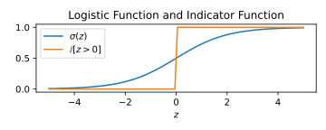
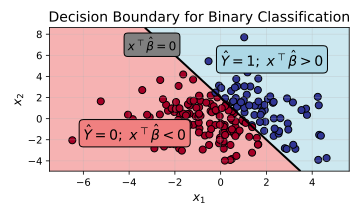

## Learning Objectives

By the end of this lecture, you will be able to:

1. Define the log-odds statistical model for binary classification, and justify its advantages
2. Derive logistic regression through empirical risk minimization (ERM)
3. Construct predictions for classifiers based on different notions of risk

## Supervised Learning for Classification: Statistical Perspective

In the previous lecture, we developed a statistical perspective of the supervised learning procedure, and we worked through the steps of the learning procedure in a regression context.

| Step | CS Perspective | Statistical Perspective | Example: Linear Regression |
| ---- | -------------- | ----------------------- | -------------------------- |
| 2    | Predictive Model | Hypothesis Class      | $\hat f(X) = X^\top \hat\beta$ |
| 3    | Training       | Estimation              | $\hat f_\mathrm{ERM}(X) = X^\top \hat\beta_\mathrm{OLS}$ |
| 6    | Testing | Prediction         | $\hat{Y}_\mathrm{new} = \hat f_\mathrm{ERM}(X)$ |

In this lecture, we will work through the same steps, but this time for **classification** problems.

**Classification versus regression**:

- In **regression**, the response variable $Y$ is continuous (i.e. $\mathcal Y = \mathbb{R}$).
- In **binary classification**, the response variable $Y$ is boolean (i.e. $\mathcal Y = \{0, 1\}$), where
   - $Y = 1$ represents the "positive" class
   - $Y = 0$ represents the "negative" class
   - (You might see $Y = -1$ used to denote the negative class. It doesn't make a huge difference, but we'll stick with $Y=0$ for mathematical simplicity.)
- The goal remains the same: learn a function $\hat{f}: \mathbb{R}^p \to \{0, 1\}$ that accurately predicts the class label for new observations.

Let's now derive a statistical model estimation procedure, and prediction rule for binary classification!

## Statistical Models for Classification

- Recall that, formally, a statistical model is a set of conditional distributions over $Y \mid X$.
- In regression, as we saw last lecture, we tend to use statistical models that characterize $Y$ as the sum of a deterministic/learnable component $f(X)$ and a Gaussian/unlearnable component $\varepsilon$.
   - This implicitly places a Gaussian distribution on $Y \mid X$:

      $$ Y = f(X) + \varepsilon, \:\: \varepsilon \sim \mathcal N(0, \sigma^2)
      \quad \Leftrightarrow \quad Y \mid X \sim \mathcal N( f(X), \sigma^2 ). $$

   - Crucially, we will have a valid Gaussian distribution for any $f(X) \in (-\infty, \infty).$
      This property makes $f$ easy to approximate with linear models.

- For classification, it's easier to start from the set of conditional distributions and derive the learnable/unlearnable components.

   - The most general set of distributions is:

      $$ Y \mid X \sim \mathrm{Bern}( \pi_1(X) ), \qquad \pi_1(x) = \mathbb P(Y=1 \mid X=x), \qquad \pi_1 \text{ is some f'n with range } [0, 1]. $$

   - Intuitively, we think of the class assignment as a weighted coin flip (the unlearnable component), where the covariates determine the weighting of the coin (the learnable bit).

- However, $\pi_1(x) = \mathbb P(Y=1 \mid X=x)$ is not the most natural parameterization of the learnable component.

   - In order to be a valid Bernoulli distribution, $\pi_1(x)$ must be between $[0, 1]$.
   - When it comes to approximating $\pi_1(x)$, we'd be restricted to hypothesis classes where the functions have this range constraint.
   - This constraint would exclude linear models.

      

         
Why?

         Consider $\pi_1(x) = x^\top \beta$. What's the problem with this?

         - If $x^\top \beta > 1$, then $\pi_1(x) = \mathbb{P}(Y=1|X=x) > 1$, which is not a valid probability.
         - If $x^\top \beta < 0$, then $\pi_1(x) = \mathbb{P}(Y=1|X=x) < 0$, which is also not a valid probability.
      

**The Log-Odds Parameterization**

- Instead of defining distributions through $\pi_1(X)$ directly, we will instead define distributions through the **log-odds ratio**

- Defining $\pi_0(x) = \mathbb P(Y=0|X=x) = 1 - \mathbb P(Y=1|X=x)$, the **log-odds ratio** is:
   $$f(x) := \log\left(\frac{\pi_1(x)}{\pi_0(x)}\right) = \log\left(\frac{\pi_1(x)}{1 - \pi_1(x)}\right)$$

- I claim that this ratio can take any real value, i.e. $f(x) \in \mathbb{R}$.

   | $\pi_1(x)$ | Odds Ratio | $f(x)$ (Log Odds Ratio) |
   |------------|------------|--------------------------|
   | $\approx 1$ | $\pi_1(x) / \pi_0(x) \to \infty$ | $f(x) \to \infty$ |
   | $\approx 0$ | $\pi_1(x) / \pi_0(x) \to 0$ | $f(x) \to -\infty$ |

- We can convert the log-odds ratio $f(x)$ to $\pi_1(x)$...

   $$ \pi_1(x) = \sigma(f(x)), \qquad \sigma(f(x)) := \frac{\exp(f(x))}{\exp(f(x)) + 1} = \frac{1}{1 + \exp(-f(x))}$$

   

      
Derivation (it's just algebra)

      Starting from the definition of $f(x)$ and solving for $\pi_1(x)$:
      \begin{align*}
         f(x) &= \log\left(\frac{\pi_1(x)}{1 - \pi_1(x)}\right) \\
         \exp(f(x)) &= \frac{\pi_1(x)}{1 - \pi_1(x)} \\
         \exp(f(x)) \, (1 - \pi_1(x)) &= \pi_1(x) \\
         \exp(f(x)) &= \pi_1(x) + \exp(f(x)) \, \pi_1(x) \\
         \exp(f(x)) &= \pi_1(x) \, (1 + \exp(f(x))) \\
         \pi_1(x) &= \frac{\exp(f(x))}{\exp(f(x)) + 1}.
      \end{align*}
      The second, equivalent form follows by multiplying the numerator and denominator by $\exp(-f(x))$:
      \begin{align*}
         \pi_1(x) = \frac{\exp(f(x))}{\exp(f(x)) + 1} = \frac{\exp(f(x)) \, \exp(-f(x))}{\left(\exp(f(x)) + 1\right)\exp(-f(x))} = \frac{1}{1 + \exp(-f(x))}.
      \end{align*}
   

- ... and so we can use $f$ to define the "learnable" component of our statistical model:

   $$ Y \mid X \sim \mathrm{Bern}(\sigma(f(X))), \qquad f \text{ is some f'n (with no range constraints)}.$$

   (As with regression, we'll want to limit $f$ to some smaller class of functions if we hope to do any sort of useful analysis.)

:::{.callout-note title="The Logistic Function"}
The function $\sigma(\cdot)$ in the above equation is known as the **logistic function** or **sigmoid function**.
It has many useful properties

   1. **Range**: $\sigma(z) \in (0, 1)$ for all $z \in \mathbb{R}$
   2. **Symmetric**: $\sigma(-z) = 1 - \sigma(z)$
   3. **Convenient derivative**: $\sigma'(z) = \sigma(z)(1 - \sigma(z))$

It can be seen as a "smooth approximation" to the 0-1 step function:

:::

## Hypothesis Class

- Since the "learnable" portion of our statistical model -- the log-odds ratio $f(X)$ -- is any real-valued function,
we can consider pretty much any hypothesis class.
- As with regression, it's not a bad idea to consider linear functions:

   $$ \mathcal H = \left\{ \hat f \: : \: \hat f(X) = X^\top \hat \beta, \: \hat \beta \in \mathbb R^p \right\} $$

- If we assume that our statistical model has the same functional form (i.e. $f(X) = X^\top \beta$ for some $\beta$),
   then we have that:

   $$
      Y \mid X \sim \mathrm{Bern}(\sigma(X^\top \beta)) = \mathrm{Bern} \left( \frac{1}{1 + \exp(-X^\top \beta)} \right),
   $$
   or alternatively,
   $$
      \mathbb P(Y=1 \mid X=x) = \frac{1}{1 + \exp(-x^\top \beta)}.
   $$

   You should recognize this equation from STAT 306 as **logistic regression.**

## Estimation

As with regression, we estimate the parameters $\beta$ through **empirical risk minimization (ERM)**: we choose the $\hat \beta$ that minimizes the average loss over the training data,

$$\hat{\beta}_\mathrm{ERM} = \mathrm{argmin}_{\beta} \frac{1}{n} \sum_{i=1}^n L(Y_i, \hat f(X_i)).$$

For classification, it doesn't make sense to use the squared error loss.
However, deriving a good loss function is a bit tricky:

**ERM with the logistic loss**:

Before suggesting a loss function, let's think intuitively through how we'd like to penalize predictions:

- If $\hat f(X)$ is very positive, then $\hat \pi_1(X) \gg \hat \pi_0(X)$ (where $\hat \pi_1$ and $\hat \pi_0$ are our predicted conditional probabilities for $Y=1$ and $Y=0$ respectively). This prediction would be bad if $Y=0$, but great if $Y=1$.
- If $\hat f(X)$ is very negative, the opposite is true: $\hat \pi_1(X) \ll \hat \pi_0(X)$, bad prediction for $Y=1$, great for $Y=0$.
- If $\hat f(X) \approx 0$, then $\hat \pi_1(X) \approx \hat \pi_0(X)$. This prediction signifies uncertainty over $Y=0$ versus $Y=1$. While not as bad as confidently predicting the incorrect class, there should still be some loss since we'd prefer a correct prediction.

To that end, consider the following function (which we'll derive from first principles in a second), known as the **logistic loss** (also referred to as the **cross-entropy loss**):

$$
\begin{gather}
L_\mathrm{logistic}(Y, \hat f(X)) = -Y \log \hat \pi_1(X) - (1 - Y) \log \hat \pi_0(X) \\
\qquad \hat \pi_1(X) = \sigma(\hat f(X)), \quad \hat \pi_0(X) = 1 - \sigma(\hat f(X)).
\end{gather}
$$

Let's check that this loss matches the desiderata above. Since $Y \in \{0, 1\}$, exactly one of the two terms is ever "active":

- If $Y = 1$, the loss is $-\log \hat \pi_1(X)$. This is small (near $0$) when $\hat \pi_1(X) \approx 1$ (i.e. $\hat f(X)$ very positive), and blows up to $+\infty$ as $\hat \pi_1(X) \to 0$ (i.e. $\hat f(X)$ very negative).
- If $Y = 0$, the loss is $-\log \hat \pi_0(X)$, which is the mirror image: small when $\hat f(X)$ is very negative, and $\to +\infty$ when $\hat f(X)$ is very positive.
- If $\hat f(X) \approx 0$, then $\hat \pi_1(X) \approx \hat \pi_0(X) \approx \tfrac{1}{2}$, so the loss is $-\log \tfrac{1}{2} = \log 2 \approx 0.69$ regardless of $Y$ -- a moderate penalty for "hedging," exactly as we wanted.

:::{.callout-note collapse="true" title="(Optional) Where Does this Loss Come From?"}
Minimizing the average logistic loss across our data is *equivalent* to maximum likelihood estimation of $\beta$.

Under the model $Y_i \mid X_i \sim \mathrm{Bern}(\hat \pi_1(X_i))$, the likelihood of the training labels is
\begin{align*}
   \prod_{i=1}^n \hat \pi_1(X_i)^{Y_i} \, \hat \pi_0(X_i)^{1 - Y_i},
\end{align*}
where the exponents "select" the correct probability: the $i$-th factor is $\hat \pi_1(X_i)$ when $Y_i = 1$ and $\hat \pi_0(X_i)$ when $Y_i = 0$.
Taking the negative logarithm turns the product into a sum:
\begin{align*}
   -\log \prod_{i=1}^n \hat \pi_1(X_i)^{Y_i} \, \hat \pi_0(X_i)^{1 - Y_i}
   &= \sum_{i=1}^n \Big[ -Y_i \log \hat \pi_1(X_i) - (1 - Y_i) \log \hat \pi_0(X_i) \Big] \\
   &= \sum_{i=1}^n L_\mathrm{logistic}(Y_i, \hat f(X_i)).
\end{align*}
So minimizing $\tfrac{1}{n} \sum_i L_\mathrm{logistic}(Y_i, \hat f(X_i))$ is the same as maximizing the likelihood.
:::

Putting it together, for logistic regression we have:

$$
\hat \beta_\mathrm{ERM}
= \mathrm{argmin}_{\beta} \frac{1}{n} \sum_{i=1}^n \left[ -Y_i \log \sigma(X_i^\top \beta) - (1 - Y_i) \log\left(1 - \sigma(X_i^\top \beta)\right) \right].
$$

:::{.callout-warning title="(Important) No Closed-Form Equation"}
Unlike with linear regression, there is no closed-form equation to express $\hat \beta_\mathrm{ERM}$ for classification.
The optimization equation above is the most we can simplify it.
We will need to rely on *numerical optimization* techniques to obtain $\hat \beta_\mathrm{ERM}$, which we will discuss later in the course.
:::

## Prediction

Let's discuss how we can make predictions using the logistic regression model given some new covariates $X_\mathrm{new}$.

- With regression, we simply used the prediction $\hat Y_\mathrm{new} = \hat f(X_\mathrm{new})$.
- With classification, we can't use the same strategy, since $\hat Y_\mathrm{new}$ must be 0 or 1,
   and $\hat f(X_\mathrm{new})$ is real-valued.

We need to put a bit more care into making a prediction $\hat Y$ given our estimated log-odds ratio,
for which we turn to the field of **decision theory**.

### Making Predictions Using Decision Theory

- We begin by assuming there is some cost $c$ associated with an incorrect prediction.

- A common cost-function for classification is:

   $$
      c(Y_\mathrm{new}, \hat Y_\mathrm{new}) = \begin{cases}
         1 & Y_\mathrm{new} \ne \hat Y_\mathrm{new} \\
         0 & Y_\mathrm{new} = \hat Y_\mathrm{new}
      \end{cases},
   $$

   often referred to as the **0/1 cost**.

:::{.callout-note title="(Important) $c$ is Theoretical"}
- When using this model to make predictions in practice, we won't ever know the "true" $Y_\mathrm{new}$. We only see $X_\mathrm{new}$
- Therefore, this cost is generally not something we compute; it's a theoretical quantity that we can reason about.
- Intuitively, the cost measures how bad our predictions would look in hindsight if eventually we were to find out the true responses associated with our predictions.
:::

- Since we don't know the true responses, we instead have to reason about them probabilistically using our estimated $\hat f$:

   $$ Y_\mathrm{new} \mid X_\mathrm{new} \sim \mathrm{Bern}( \sigma(\hat f(X_\mathrm{new}))), $$

   and thus we can think about the *expected cost* of a prediction:

   $$ \mathbb E[ c(Y_\mathrm{new}, \hat Y_\mathrm{new}) \mid X_\mathrm{new}, \hat f]. $$

- According to **decision theory**, the best choice for $\hat Y_\mathrm{new}$ is the one that minimizes expected cost:

   $$ \hat Y_\mathrm{new} = \mathrm{argmin}_{\hat y_\mathrm{new}} \mathbb E[ c(Y_\mathrm{new}, \hat y_\mathrm{new}) \mid X_\mathrm{new}, \hat f]. $$

- Perhaps unsurprisingly, under the 0/1 cost, this decision simplifies down to:

   $$ \hat Y_\mathrm{new} = \begin{cases}
      1 & \hat f(X_\mathrm{new}) \geq 0 \quad \text{(alternatively, } \hat \pi_1(X_\mathrm{new}) \geq 0.5, \: \hat \pi_0(X_\mathrm{new}) < 0.5 \text{)} \\
      0 & \hat f(X_\mathrm{new}) < 0 \quad \text{(alternatively, } \hat \pi_1(X_\mathrm{new}) < 0.5, \: \hat \pi_0(X_\mathrm{new}) \geq 0.5 \text{)}
   \end{cases}. $$

   

      
Derivation

      The expected 0/1 cost of predicting $\hat y_\mathrm{new}$ is a sum over the two possible outcomes, each weighted by its probability under our model:
      \begin{align*}
      \hat{Y}_\mathrm{new}
      &= \mathrm{argmin}_{\hat y_\mathrm{new}} \mathbb{E}[ \mathbb{I}(Y_\mathrm{new} \neq \hat y_\mathrm{new}) \mid X_\mathrm{new}, \hat f] \\
      &= \mathrm{argmin}_{\hat y_\mathrm{new}} \mathbb{P}(Y_\mathrm{new} \neq \hat y_\mathrm{new} \mid X_\mathrm{new}, \hat f) \\
      &= \mathrm{argmin}_{\hat y_\mathrm{new}} \left[
         \underbrace{\hat \pi_1(X_\mathrm{new})}_{\mathbb{P}(Y_\mathrm{new} = 1)} \, \mathbb{I}(\hat y_\mathrm{new} = 0) +
         \underbrace{\hat \pi_0(X_\mathrm{new})}_{\mathbb{P}(Y_\mathrm{new} = 0)} \, \mathbb{I}(\hat y_\mathrm{new} = 1) \right].
      \end{align*}
      We should therefore predict $\hat y_\mathrm{new} = 1$ whenever doing so incurs the smaller expected cost, i.e. whenever $\hat \pi_0(X_\mathrm{new}) \leq \hat \pi_1(X_\mathrm{new})$. Since $\hat \pi_0 = 1 - \hat \pi_1$, this is exactly the condition $\hat \pi_1(X_\mathrm{new}) \geq 0.5$. Finally, recall that $\hat \pi_1(X_\mathrm{new}) = \sigma(\hat f(X_\mathrm{new})) \geq 0.5$ if and only if $\hat f(X_\mathrm{new}) \geq 0$.
   

:::{.callout-tip title="The Decision Boundary"}
- The **decision boundary**, defined by:

  $$\hat f(x) = 0$$

  is the hyperplane that separates the $x$s for which we would predict $\hat Y = 1$ versus $\hat Y = 0$.

- For logistic regression, where $\hat f(x) = x^\top \hat \beta$, this decision boundary is a (linear) hyperplane.
   This is one reason why we consider logistic regression to be a "linear method."

:::

### How Costs Affect Decisions

- While the derivation above was perhaps a complicated way to obtain a simple prediction rule,
   decision theory shows its power when we start considering alternative costs.

- For example, imagine a world where **false-positive predictions** (predicting $\hat Y = 1$ when $Y=0$) were twice as bad as **false-negative predictions** (predicting $\hat Y = 0$ when $Y=1$).

   - We could codify this idea into a cost function:

      $$ c(Y_\mathrm{new}, \hat Y_\mathrm{new}) = \begin{cases}
      0 & \hat Y_\mathrm{new} = Y_\mathrm{new} \quad \text{(correct prediction)} \\
      2 & \hat Y_\mathrm{new} = 1, \: Y_\mathrm{new} = 0 \quad \text{(false positive)} \\
      1 & \hat Y_\mathrm{new} = 0, \: Y_\mathrm{new} = 1 \quad \text{(false negative)}
      \end{cases}. $$

   - Now considering our decision theoretic rule:
      $$ \hat Y_\mathrm{new} = \mathrm{argmin}_{\hat y_\mathrm{new}} \mathbb E[ c(Y_\mathrm{new}, \hat y_\mathrm{new}) \mid X_\mathrm{new}, \hat f], $$

      the $\hat f$ estimate is the same as above but now the cost function $c$ is different. Thus we should end up with a different rule for $\hat Y_\mathrm{new}$.

   - Turning the crank, we have:

      $$ \hat Y_\mathrm{new} = \begin{cases}
      1 & \hat \pi_1(X_\mathrm{new}) \geq \tfrac{2}{3} \quad \text{(alternatively, } \hat f(X_\mathrm{new}) \geq \log 2 \text{)} \\
      0 & \hat \pi_1(X_\mathrm{new}) < \tfrac{2}{3} \quad \text{(alternatively, } \hat f(X_\mathrm{new}) < \log 2 \text{)}
      \end{cases}. $$

      Making false positives more costly makes us more "conservative" about predicting $\hat Y_\mathrm{new} = 1$: we now require $\hat \pi_1(X_\mathrm{new}) \geq \tfrac{2}{3}$ rather than just $\geq \tfrac{1}{2}$.

      

         
Derivation

         The expected costs of the two possible predictions are
         \begin{align*}
            \mathbb E[ c(Y_\mathrm{new}, 1) \mid X_\mathrm{new}, \hat f] &= 2 \, \hat \pi_0(X_\mathrm{new}) & \text{(cost 2 incurred only if } Y_\mathrm{new} = 0), \\
            \mathbb E[ c(Y_\mathrm{new}, 0) \mid X_\mathrm{new}, \hat f] &= 1 \, \hat \pi_1(X_\mathrm{new}) & \text{(cost 1 incurred only if } Y_\mathrm{new} = 1).
         \end{align*}
         We predict $\hat Y_\mathrm{new} = 1$ whenever its expected cost is no larger, i.e. whenever
         \begin{align*}
            2 \, \hat \pi_0(X_\mathrm{new}) \leq \hat \pi_1(X_\mathrm{new}).
         \end{align*}
         Substituting $\hat \pi_0 = 1 - \hat \pi_1$ and solving:
         \begin{align*}
            2 \left(1 - \hat \pi_1(X_\mathrm{new})\right) \leq \hat \pi_1(X_\mathrm{new})
            \quad \Longleftrightarrow \quad 2 \leq 3 \, \hat \pi_1(X_\mathrm{new})
            \quad \Longleftrightarrow \quad \hat \pi_1(X_\mathrm{new}) \geq \tfrac{2}{3}.
         \end{align*}
         Finally, since $\hat \pi_1(X_\mathrm{new}) = \sigma(\hat f(X_\mathrm{new}))$, the condition $\hat \pi_1(X_\mathrm{new}) \geq \tfrac{2}{3}$ is equivalent to $\hat f(X_\mathrm{new}) \geq \log\left(\tfrac{2/3}{1/3}\right) = \log 2$.
      

- In general, we can encode any weighting of false positives versus false negatives into the cost, and the resulting rule is just a threshold on $\hat \pi_1(X_\mathrm{new})$ (equivalently, on $\hat f(X_\mathrm{new})$) that shifts with the relative costs.

## Summary

This lecture extended the statistical framework from regression to classification:

1. **Statistical Model**: The log-odds model provides a principled way to model binary responses while ensuring probabilities stay in $[0, 1]$.

2. **Hypothesis Class**: We can estimate the log-odds ratio with a linear function of the covariates.
   (There are more complicated hypothesis classes which we'll explore in future lectures.)

3. **Estimation**: The logistic regression ERM solution cannot be computed analytically; it requires numerical methods such as gradient descent.

4. **Prediction**: The optimal prediction rule depends on the cost function.

5. **Linear Decision Boundary**: Under the $0/1$ cost, the $Y=0$ and $Y=1$ predictions are separated by a hyperplane defined by the decision boundary $X^\top \hat \beta = 0$.

In the next lecture, we will explore the last remaining steps of the learning procedure: model selection and evaluation.
