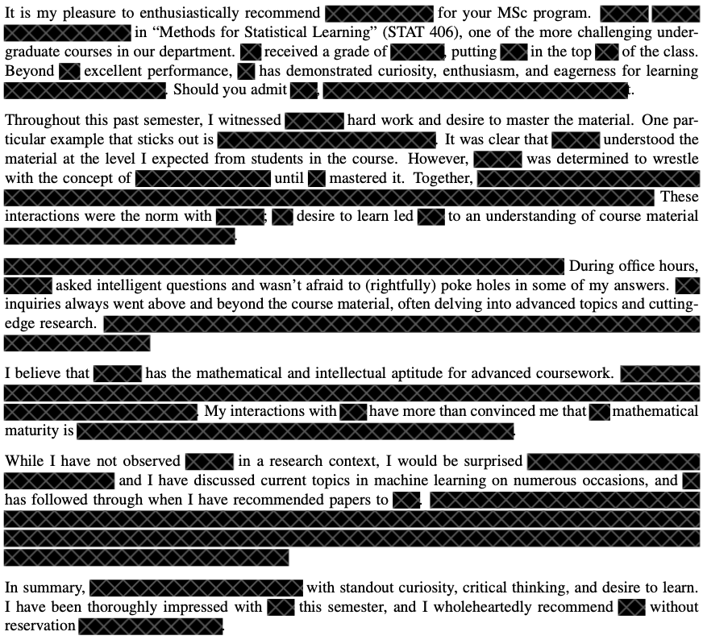
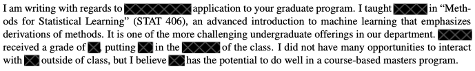



## Who am I?

::: flex

::: w-50
**Vivian Meng**

- [vivian.meng\@stat.ubc.ca](mailto:vivian.meng@stat.ubc.ca){.email}
- Lecturer, Department of Statistics
  - since 2021 (ish?)
:::

## TAs
- Justin Zhang
- Hasmik Margaryan
- Daniel Pliego

## Who are You?

::: {.incremental}
- Stats major?
- Took STAT 306?
- Took CPSC 340?
- Feel "knowledgable" about ML?
- Need this course to graduate?
:::

## This Course

**Goal**:

- Develop deep statistical intuitions about prediction and learning
- Draw connections between modelling/learning paradigms

**Assumptions**:

- You have familiarity with linear models (STAT 306) or ML basics (CPSC 340)
- You are willing to put in the work!

## Differences from Prior Courses

 

::: {.columns}
::: {.column}
### If You've Taken STAT306

- Risks analyses
- High dimensional learning methods
- Non-linear learning methods
- Non-parametric learning methods
- Unsupervised learning methods
- "Modern" methods (deep learning/ensembles)
:::

::: {.column}
### If You've Taken CPSC340

- Surface level: mostly same content
- Under the hood: more depth/stats
  - Statistical modelling/model selection
  - Bias-variance tradeoff
  - Curse of dimensionality
  - Black-box computational methods
  - Generative versus discrminative modelling
:::
:::

# Course Content and Learning Outcomes

## What is Statistical Learning?

*A history lesson*

::: {.columns .fragment}
::: {.column .m-5 width="60%"}
### Early AI, Summers, and Winters
- 1950s: "intelligent machines", Turing test
- 1960s-80s: Early perceptrons, rule-based systems, hype cycles
- 1970s-80s: AI winter(s)
:::

::: {.column .ml-5 width="40%"}
{width="40%"}
{width="40%"}
:::
:::

## What is Statistical Learning?

### Meanwhile, in Statistics Land...

Statisticians are developing frameworks for reasoning, predicting, and making decision from data.

- 1800s (Legendre and Gauss): predicting form data (least squares)
- 1910s (Fisher): estimating unknown parameters (MLE)
- 1940s (Shannon): quantifying information in data (information theory)
- 1950s (Wald): making decisions from data (decision theory)
- 1970s-80s: blackbox computer-based algorithms (bootstrap, MCMC)

::: {.fragment}
🧐 Aren't these the same goals that the AI community has? 🧐
:::

## What is Statistical Learning?

::: {.columns}
::: {.column width="70%"}
### Statistians Guide AI
- 1980s (Vapnik, Chervonenkis): statistical learning theory
  - Study learning general knowledge from data
  - Mathematical formalism for when learning is possible
- 1990s-2000s: new algorithms based on stats\
    - Support vector machines
    - Bagging/random forests
    - Topic modelling
- Applications in the new internet economy (search, ads, product recommendations)
- AI $\rightarrow$ machine learning
:::
::: {.column width="30%"}

:::
:::

## What is Statistical Learning?

::: {.columns}
::: {.column width="60%"}
### Statisticians Play Catch-Up
- 2010s: deep learning revolution
    - Stats: ideas as "unprincipled"
    - CS: see lots of empirical success
- 2020s: generative AI
    - Breakthroughs come from scale (more data, more compute)
    - Big gap between theory and practice
    - Core ideas are stat. learning principles
:::
::: {.column width="40%"}

:::
:::

## Course Learning Outcomes

1. **Formulate and analyze** machine learning algorithms from a statistical perspective
2. **Categorize** learning methods through multiple criteria
3. **Draw connections** between any two learning algorithms and paradigms
4. **Reason** about which methods are most appropriate for a given situation
5. **Apply** these methods correctly, troubleshoot common pitfalls, and identify probable steps for improving
6. **Implement** and utilize models in R using best coding practices

## 6 Modules

Each module has a **technical content theme** (*and a statistical principles theme*)

1.  **Basic regression/classification** (*statistical modelling/selection*)
2.  **Linear methods, regularization, featurization** (*bias-variance tradeoff*)
3.  **Nonparametric methods** (*curse of dimensionality*)
5.  **Unsupervised learning** (*generative vs. discriminative modelling*)
4.  **Ensembles** (*black-box methods*)
6.  **Deep learning**

# Logistics / Syllabus

## Course Components

1. **In-Class** *(discussion, mathematical derivations)*
2. **Labs** *(coding, tools, how-tos)*
3. **Homework Assignments** *(synthesis, debugging, analysis)*
4. **Exams** *(all of the above)*

## Grading Structure

::: {.columns}
::: {.column}
### Knowledge Based (42 points)

| Component   | Points        |
|-------------|---------------|
| Midterm     | 12 points     |
| Final       | 30 points     |
| **Total**   | **42 points** |
:::

::: {.column}
### Effort Based (58 points)

| Component   | Points        |
|-------------|---------------|
| Clickers    | 10 points     |
| Labs        | 18 points     |
| Homework    | 40 points     |
| **Total**   | **58 points** |
:::
:::

## 🧐 10 + 18 + 40 > 58??? 🧐

:::{.columns}
:::{.column}

| Component   | Points        |
|-------------|---------------|
| Clickers    | 10 points     |
| Labs        | 18 points     |
| Homework    | 40 points     |
| **Total**   | **58 points** |

:::
:::{.column}

:::
:::

. . .

$$\text{effort} = \min\left\{58, \text{clickers} + \text{lab} + \text{hw}\right\}$$

### Get 58 of the 68 total points any way you want
- Skip class + perfect on labs/homework = 58 points
- Miss 1 homework + get in-class points = 58 points
- (More on this later)

# In-Class

## Class Structure

- **Lecture**: I'll go over content
- **Derivations**: You'll do math in groups
- **Discussions**: We'll analyze content together
- **Clickers**: You'll apply your knowledge (in pairs)

. . .

 

::: {.callout-important}
8am is hard.

**Attendance is optional.**
:::

## Reasons to Skip Class

1. **If you're sleep deprived**\
*Getting more sleep may be beneficial to your learning in the long run*

2. **If you're not going to engage/participate**\

3. **If you're going to have your laptop open**\
*Do your homework/social media browsing/k-pop video watching in the comfort of your own home; then revisit the course material on your own time*

## Reasons to Attend Class (without Distractions)

### 1. Time to Think/Digest/Struggle with the Material
- Developing deep intuitions takes time/effort.
- Class gives you 3 hours/week to chew on the material.
- I'll pace the material accordingly

## Reasons to Attend Class (without Distractions)

### 2. In-Class is Where We Wrestle with Math
- There is lots of math in the course
- We will spend time in class working through derivations together
- Working through derivations builds intuitions and deep knowledge
- Few opportunities on labs/homeworks for this kind of work

## Reasons to Attend Class (without Distractions)

### 3. Questions and Discussions
- There's plenty of online materials that teach you this content (books, videos, etc)
- There's few opportunities to discuss content with peers/experts
- *If you're graduating this year, this course may be one of your last opportunities for this type of learning!*

## Reasons to Attend Class (without Distractions)

### 4. Effort-Based Points
- If you skip class, you'll need to get a perfect grade on labs/homeworks to get a maximum effort-based grade
- If you attend class, you can miss a few clicker questions, mess up on a homework, and still get a perfect grade!

## Reasons to Attend Class (without Distractions)
### 5. Recommendation Letters

:::{.columns .fragment}
:::{.column}
**What I Write for Students who Attend/Participate/Ask Questions**

:::

:::{.column .fragment}
**What I Write for Students who Just "Show Up"**

*I don't get to know you, so all I can talk about is your grade.*

:::
:::

## TLDR

- Waking up early, avoiding distractions, and participating is hard
- If you don't have the energy or mental bandwidth on any given day, give yourself the gift of staying home.
- If you come in, be prepared to engage and put in effort.

## Earning Points

### Clickers (10 points)
-   We will use [iClicker](https://lthub.ubc.ca/guides/iclicker-cloud-student-guide/) for questions that are similar to the midterm/final
-   I will tally up all the clicker points at the end of term, give people some slack for missing 15% of questions, and assign you a clicker grade from 0-10.
-   Make sure you include your Student ID in your iClicker student profile.

# Labs / Assignments

## Mechanics and Grading

The goal is to "Do the work"

::: {.columns}
::: {.column}
### Labs

* Labs should give you practice, allow for questions with the TAs.

* They are due at 2359 on Saturday, lightly graded.

* You may do them at home, but you must submit individually

* Labs are lightly graded (complete nonsense/ reasonable effort/ mostly correct)
:::

::: {.column}
### Assignments

* Not easy, especially the first 2, especially if you are unfamiliar with R / Rmarkdown / ggplot

* Don't leave these for the last minute. I will post the assignments early and the due dates have already been scheduled.
:::
:::

## Tools: R, Rmarkdown, LaTex

:::{.columns}
:::{.column}
- **Language/Libraries:** R + Tidyverse

- **Submission:** on Canvas

::: {.callout-important .fragment}
We assume you're familiar with these tools (R, Tidyverse)

If you're not, it's your responsibility to get up-to-speed with them.

See Canvas for tutorials / the website for resources.
:::
:::

:::{.column .fragment}
### Workflow

* For each lab or assignment you will be given a template .Rmd file that you will fill-out and *knit* into a pretty pdf file for submission.

* You will learn about this process in lab00 next week

* Submit both .Rmd and .pdf file on Canvas.
:::
:::

## Generative AI Policy

- **AI tools are quite capable** with this material
- **Strong recommendation: Use AI as little as possible** to maximize learning
- If you use AI, use it to **supplement your thinking** (code completion, rewriting) not **replace your thinking** (feeding entire assignments to chatbots)

## Why Minimize AI Use?

1. **Deep intuitions require struggle**\
*The only way to develop intuitions about challenging material is to wrestle with content*

2. **Stand out from the crowd**\
*Anyone can use Claude/Copilot for simple ML. Demonstrate thinking beyond these tools will make you more hireable/trusted*

3. **Course-specific subtleties**\
*Even with good prompting, chatbots likely won't score above 7-8 on assignments*

4. **No AI on exams**\
*Don't become too dependent on tools you can't use during midterm/final*

## If you Use Generative AI...

 

**Self-reporting required:**

- Describe your AI usage on all assignments and labs.
- Include all prompts you use.
- Please be honest (it'll help me improve the course/your learning experience)
- No grade penalty

## Late policy

No late assignments accepted, but if you are late by a little ... it's fine.

. . .

 

| **When you submit**     | **Likelihood that your submission gets a 0** |
|-------------------------|------------------------------------------------------------|
| Before 11:59pm on due date\ (i.e. on time) | 0%                                        |
| 11:01pm on due date     | 0.001%                                                       |
| 9am after due date      | 0.1%                                                        |
| 2 days after due date  | 99.99999999%                                               |

. . .

 

**Exception**: when you have grounds for academic consession.
(See the [UBC policy](https://science.ubc.ca/students/concession).)

:::callout-tip
**Remember**: you can still get a "perfect" effort grade even if you get a 0 on one assignment.
:::

# Reading/Textbook

## Lecture Notes

::: callout-important
## Lecture Notes (Primary Reading)

Prof. Geoff Pleiss wrote detailed lecture notes for every class.

**I strongly recommend reading them before class.**\
*No quizzes/knowledge demonstration/accountability for not reading, but please do!*
:::

Reading before class will improve your preparation and ability to engage.

## Optional Textbooks

::: {.columns}
::: {.column}
::: callout-tip
## An Introduction to Statistical Learning

James, Witten, Hastie, Tibshirani, 2013, Springer, New York. (denoted \[ISLR\])

Available **free** online: http://statlearning.com/
:::
:::

::: {.column}
::: callout-tip
## The Elements of Statistical Learning

Hastie, Tibshirani, Friedman, 2009, Second Edition, Springer, New York. (denoted \[ESL\])

Also available **free** online: https://web.stanford.edu/\~hastie/ElemStatLearn/
:::
:::
:::

- The schedule lists optional readings from these textbooks for each lecture
- [ESL] is more advanced — optional and supplemental throughout

# Knowledge-Based Assessment

## Exams

::: {.columns}
::: {.column}
### Midterm Exam

-   In-class, October 27
-   Computer-based
-   T/F, multiple choice, etc.

:::
::: {.column}
### Final Exam

-   Scheduled by the university.
-   It is hard
-   The median last year was 65% $\Rightarrow$ A-
-   Format: TBD

:::
:::

. . .

 

### Philosophy

- If you put in the effort, you're guaranteed a C+.
- To get an A+, you need to deeply understand the material.
- No penalty for skipping the midterm/final.

## Time expectations per week:

-   Coming to class -- 3 hours

-   Reading the book/lecture notes -- 1 hour

-   Labs -- 1 hour

-   Homework -- 4 hours

-   Study / thinking / playing -- 1 hour

# Resources

## Computer

::: {.columns}
::: {.column}

:::

::: {.column}
* We will use R and we assume some background knowledge.

* Suggest you use **RStudio** IDE

* See <https://ubc-stat.github.io/stat-406/> for what you need to install for the whole term.

* Links to useful supplementary resources are available on the website.

:::
:::

## Other Resources

1. **Course website**\
All the material (slides, extra worksheets) <https://ubc-stat.github.io/stat-406>

2. **Piazza**\
Discussion board, questions
  - Note that students are expected to help each-other... Explaining things is a good way to consolidate your knowledge! The teaching team will endorse good answers, and chime-in when needed.

4. **Canvas**\
Homework / Lab submission

## Final Words of Wisdom

::: {.fragment}
- 8am is hard. But you can do it!
    - I strongly urge you to get up at the same time everyday.
:::

::: {.fragment}
- If you need help, please ask!
    - I'm here to encourage you, get you un-stuck, and ponder ML mysteries with you
:::

::: {.fragment}
- Think of this course as preparation for a race/performance/etc.
    - You have to work out/practice, and there's no shortcuts.
    - Training is hard, but you'll be pleased with the outcome if you put in the work.
    - We're here to help you stay excited and motivated on your journey!
:::

::: {.fragment}
- Join me on a fun exploration of cool material!
:::

# Questions?

## TODOs

::: {.columns}
::: {.column}
**By EOD Tomorrow:**

1. Read the syllabus
2. Install the R package, read docs, check your LaTeX installation\
*BE SURE to follow the Computer Setup instructions on the website!*

:::
::: {.column}

**Before Next Tuesday:**

1. Sign up for Piazza (see Canvas)
2. Add the correct iClicker course and make sure you provide your Student ID.

:::
:::

